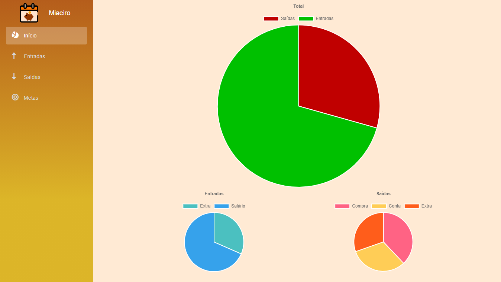
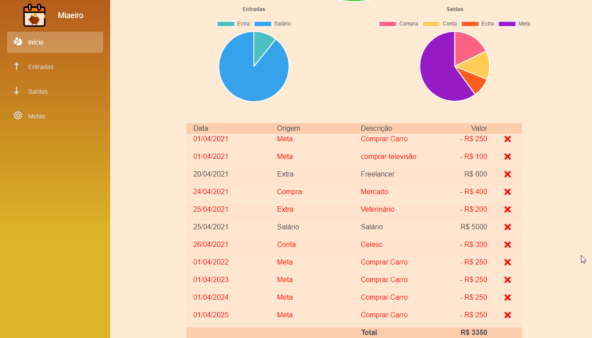
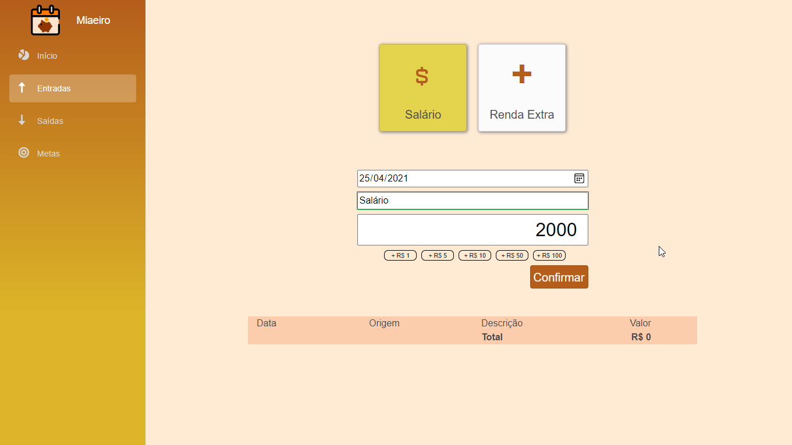
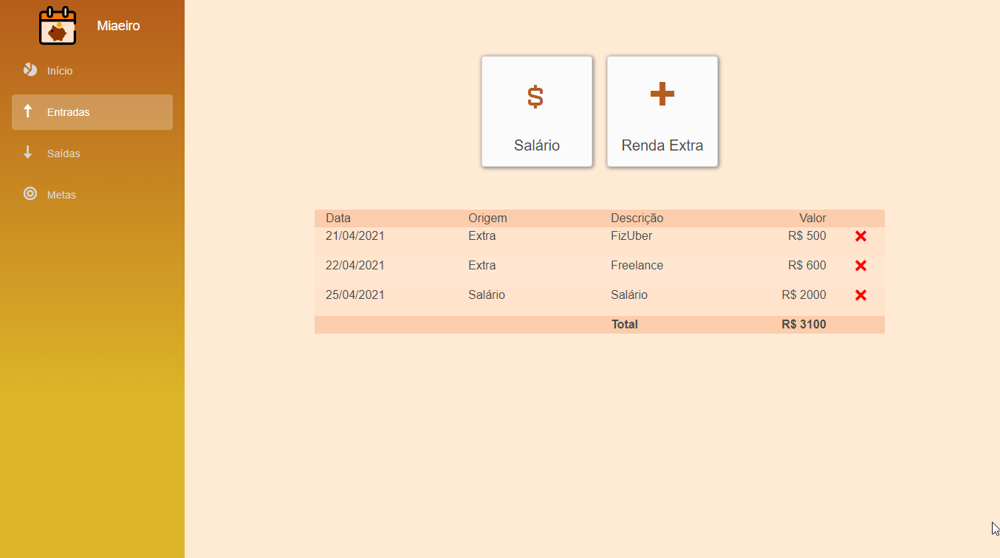
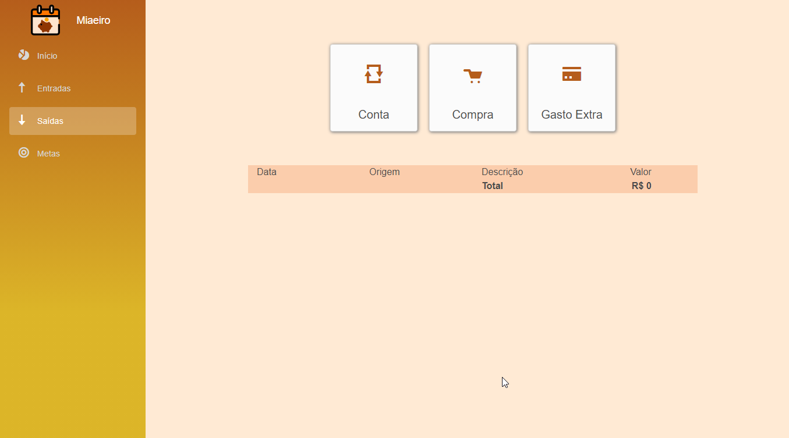
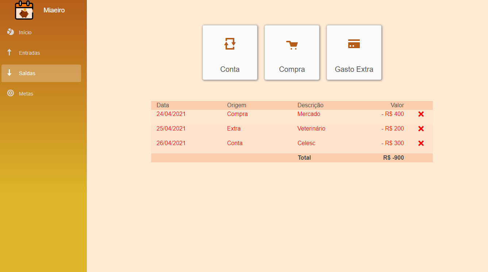
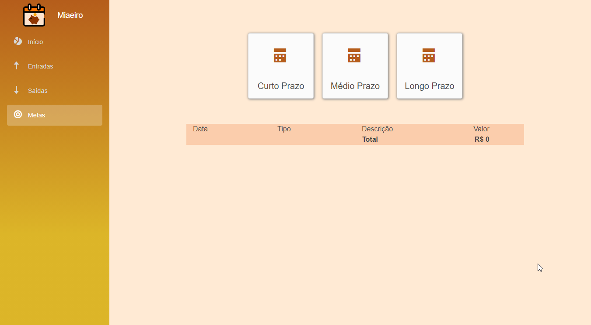
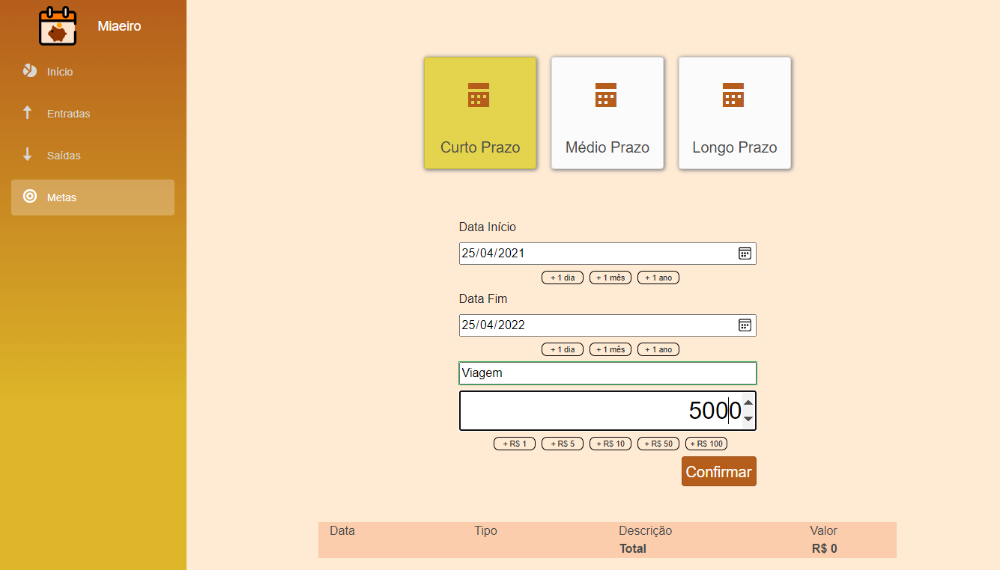
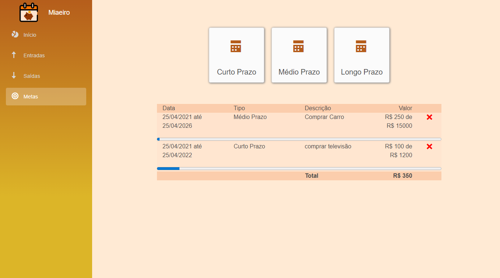

# Miaeiro
Protótipo para A1 da Unidade Curricular Inteligência e Otimização de Interfaces

## Link para o protótipo

[Protótipo](https://katharinapedrosa.github.io/Miaeiro/)

* **Pré- Condições**
Para gerar os  gráficos é necessário incluir dados de entradas, saídas e metas. O protótipo é funcional e salvará todas as informações incluídas.

## Ferramenta utilizada

[Blazor](https://dotnet.microsoft.com/apps/aspnet/web-apps/blazor)

Escolhi o framework de desenvolvimento Blazor para a construção de um protótipo funcional, porque este tipo de protótipo apresenta comportamento mais próximo da realidade do produto final. Sobre o Blazor, a escolha se deu por possibilitar desenvolvimento rápido, devido a estrutura de navegação, componentes prontos, facilidade na criação de formulários e compatibilidade com qualquer ambiente. 

## Início

* No 'Menu', a ideia foi mantê-lo sempre visível  com poucas opções e sem sub-menus. Indicando a página atual através da mudança de cor.
* Sobre  a 'Tela Inicial',apresenta um gráfico com  informações referentes aos dados de movimentações financeiras do mês corrente. O gráfico maior apresenta as informações de entradas e saídas, enquanto os gráficos menores detalham estas movimentações (o da esquerda - entradas, e o  da direta- saídas.) 
* A tabela apresenta o extrato mensal e mostra o saldo total. 

## Entradas

* Nesta tela o usuário incluirá as entradas por tipo. Quando o card estiver selecionado, apresentará cor diferente. Para incluir os valores, há a possibilidade de usar botões de adição para facilitar a digitação em dispositivos móveis que não possuem teclado físico. Ao apertar no botão 'Confirmar', os dados inseridos serão apresentados  na tabela abaixo.
Importante: O protótipo não permitirá a inclusão de informações sem data ou com o valor zerado.  

## Saídas

* Nesta tela o usuário incluirá as saídas por tipo. Quando o card estiver selecionado, apresentará cor diferente. Para incluir os valores, há a possibilidade de usar botões de adição para facilitar a digitação em dispositivos móveis que não possuem teclado físico. Ao apertar no botão 'Confirmar', os dados inseridos serão apresentados  na tabela abaixo.
Importante: O protótipo não permitirá a inclusão de informações sem data ou com o valor zerado. 

## Metas

*Nesta tela,o usuário poderá gerenciar suas metas de curto, médio e longo prazo. Para isso, definirá as datas iniciais e finais, incluirá descrição e o valor que deseja alcançar para atingir a meta.  Para incluir as datas e os valores, há a possibilidade de usar botões de adição para facilitar a digitação em dispositivos móveis que não possuem teclado físico.
O valor inserido é apresentado junto a uma barra de progresso, mostrando quanto em dinheiro já foi pago para o alcance da meta.

Importante: O valor inserido entrará no gráfico de Despesas, dividido pelos meses estabelecidos no prazo. 

